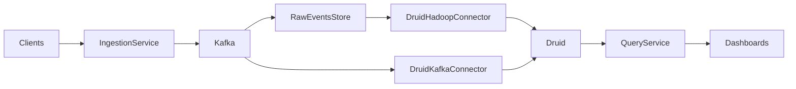

# Flow Aggregation Service
## Introduction
The goal of the service is to accept monitoring events, aggregating them and returning these aggregations. This doc 
discusses the design and the implementation of the demo service and also requirements of production system and brief
notes on such production system.
  
## Demo Design
This service exposes 2 APIs: GET /flows?hour=hour and POST /flows. Read API returns list of events aggregated by
subset of flow attributes. Write API accepts list of flows.

Each flow consist of hour, source_app, destination_app, vpc_id, bytes rx and bytes tx. Attributes are divided into 
2 categories, dimensions and metrics. Dimension is the attribute is used to slice and dice multiple types of aggregations
of metrics. In this design, only sum aggregation is supported. Flow attributes hour, source_app, destination_app and vpc_id 
are dimensions and bytes rx and bytes tx are metrics. 

Current implementation is backed by [metrics db](https://github.com/vishnuvisnu/flow-aggregation-service/blob/main/src/main/java/com/netflix/demo/db/MetricsDB.java#L13) implemented using [Roaring bitmap](https://github.com/RoaringBitmap/RoaringBitmap).
In the current implementation, only 2 dimensions are created: hour and combination of source_app, destination_app and vpc_id
referred as flow_key. As part of this demo, Read API is only interested in aggregating by flow_key and grouped by hour, 
which is why 2 dimensions are sufficient.

Flows are that are shown in Table 1 are represented by combination of data structures defined in Table 2, 3 and 4.

Table 1

| Hour | Source App | Dest App | Vpc Id  | Bytes Rx | Bytes Tx |     
|------|------------|----------|---------|----------|----------|
| 1    | app1       | app2     | vpc1    | 10       | 11       |
| 1    | app1       | app2     | vpc1    | 20       | 21       |     
| 2    | app1       | app2     | vpc1    | 30       | 31       |    
| 2    | app1       | app2     | vpc1    | 40       | 41       |   
| 2    | app1       | app2     | vpc1    | 50       | 51       |       
| 2    | app1       | app3     | vpc1    | 60       | 61       |      
| 2    | app1       | app3     | vpc1    | 70       | 71       |     
| 2    | app1       | app3     | vpc1    | 80       | 81       |    
| 2    | app2       | app4     | vpc1    | 90       | 91       |   
| 2    | app2       | app4     | vpc1    | 100      | 101      |  

Table 2

| 0     | 1     | 2     | 3     | 4     | 5     | 6     | 7     | 8     | 9       |   
|-------|-------|-------|-------|-------|-------|-------|-------|-------|---------|
| 10,11 | 20,21 | 30,31 | 40,41 | 50,51 | 60,61 | 70,71 | 80,81 | 90,91 | 100,101 |

Table 3

| Hour  | Bitmap (of indices)      |   
|-------|--------------------------|
| 1     | [0, 1]                   |
| 2     | [2, 3, 4, 5, 6, 7, 8, 9] |

Table 4

| Flow Key       | Bitmap (of indices) |   
|----------------|---------------------|
| app1,app2,vpc1 | [0, 1, 2, 3, 4]     |
| app1,app3,vpc1 | [5, 6, 7]           |
| app2,app4,vpc1 | [8, 9]              |

### Read API implementation

```
GET /flows?hour=2

metrics = array of metric values in Table 2.
hour_2_bitmap = look up table 3.
flows = empty list
for each flow_key in table 4
   masked = bitmap(flow_key) & hour_2_bitmap
   aggregated_metrics = (indices(masked), metrics)
   flow = (flow_key, hour_2, aggregated_metrics)
   add flow to flows
return flows
```

### Write API implementation

```
POST /flows
{flow}

hour = hour(flow)
flow_key = (src_app(flow), dest_app(flow), vpc_id(flow))
add flow_key bitmap to table 4 if not exists.
update flow_key bitmap in table 4 if exists
add hour bitmap to table 3 if not exists
update hour bitmap in table 3 if exists
add (bytesRx, bytesTx) to table 2.
```
## Scaling Parameters
Write API is constant time. Read API is O(number of combinations of source_app, dest_app and vpc_id). Both read and write apis can
be scaled not depending on number of incoming events. Data need to be partitioned to maintain this scaling parameters for this service.
## Next
This service is designed to work for grouping by hour and aggregating by the combination of source_app, destination_app and 
vpc_id. Service can be extended to slice and dice by any combination of hour, source_app, destination_app and vpc_id with
trivial changes to the code base.
### Partitioning
This service maintains data structures for all the data in one place. Data need to be partitioned for the service to be 
available and scalable. Time (hour) can be used to partition the data assuming that time(hour) is always used to index 
the metrics which is usually the case with the operational metrics. Current design of the metricsDB can be extended to partition 
the data by hour.

## Testing
```
set -B                  # enable brace expansion
for i in {1..10}; do
  curl -X POST "http://localhost:8080/flows" -H 'Content-Type: application/json' -d '[{"src_app": "foo", "dest_app": "bar", "vpc_id": "vpc-0", "bytes_tx":220, "bytes_rx": 150, "hour": 1}]' &
  curl -X POST "http://localhost:8080/flows" -H 'Content-Type: application/json' -d '[{"src_app": "foo", "dest_app": "bar", "vpc_id": "vpc-0", "bytes_tx":220, "bytes_rx": 150, "hour": 2}]' &
  curl -X POST "http://localhost:8080/flows" -H 'Content-Type: application/json' -d '[{"src_app": "foo", "dest_app": "bar", "vpc_id": "vpc-0", "bytes_tx":220, "bytes_rx": 150, "hour": 3}]' &
  curl -X POST "http://localhost:8080/flows" -H 'Content-Type: application/json' -d '[{"src_app": "foo", "dest_app": "bar", "vpc_id": "vpc-0", "bytes_tx":220, "bytes_rx": 150, "hour": 4}]' &
  curl -X POST "http://localhost:8080/flows" -H 'Content-Type: application/json' -d '[{"src_app": "foo", "dest_app": "bar", "vpc_id": "vpc-0", "bytes_tx":220, "bytes_rx": 150, "hour": 5}]' &
done

for i in {1..10}; do
  curl -X POST "http://localhost:8080/flows" -H 'Content-Type: application/json' -d '[{"src_app": "foo'"${i}"'", "dest_app": "bar", "vpc_id": "vpc-0", "bytes_tx":220, "bytes_rx": 150, "hour": 1}]' &
  curl -X POST "http://localhost:8080/flows" -H 'Content-Type: application/json' -d '[{"src_app": "foo'"${i}"'", "dest_app": "bar", "vpc_id": "vpc-0", "bytes_tx":220, "bytes_rx": 150, "hour": 2}]' &
  curl -X POST "http://localhost:8080/flows" -H 'Content-Type: application/json' -d '[{"src_app": "foo'"${i}"'", "dest_app": "bar", "vpc_id": "vpc-0", "bytes_tx":220, "bytes_rx": 150, "hour": 3}]' &
  curl -X POST "http://localhost:8080/flows" -H 'Content-Type: application/json' -d '[{"src_app": "foo'"${i}"'", "dest_app": "bar", "vpc_id": "vpc-0", "bytes_tx":220, "bytes_rx": 150, "hour": 4}]' &
  curl -X POST "http://localhost:8080/flows" -H 'Content-Type: application/json' -d '[{"src_app": "foo'"${i}"'", "dest_app": "bar", "vpc_id": "vpc-0", "bytes_tx":220, "bytes_rx": 150, "hour": 5}]' &
  curl -X POST "http://localhost:8080/flows" -H 'Content-Type: application/json' -d '[{"src_app": "foo'"${i}"'", "dest_app": "bar", "vpc_id": "vpc-0", "bytes_tx":220, "bytes_rx": 150, "hour": 6}]' &
  curl -X POST "http://localhost:8080/flows" -H 'Content-Type: application/json' -d '[{"src_app": "foo'"${i}"'", "dest_app": "bar", "vpc_id": "vpc-0", "bytes_tx":220, "bytes_rx": 150, "hour": 1}]' &
  curl -X POST "http://localhost:8080/flows" -H 'Content-Type: application/json' -d '[{"src_app": "foo'"${i}"'", "dest_app": "bar", "vpc_id": "vpc-0", "bytes_tx":220, "bytes_rx": 150, "hour": 2}]' &
  curl -X POST "http://localhost:8080/flows" -H 'Content-Type: application/json' -d '[{"src_app": "foo'"${i}"'", "dest_app": "bar", "vpc_id": "vpc-0", "bytes_tx":220, "bytes_rx": 150, "hour": 3}]' &
  curl -X POST "http://localhost:8080/flows" -H 'Content-Type: application/json' -d '[{"src_app": "foo'"${i}"'", "dest_app": "bar", "vpc_id": "vpc-0", "bytes_tx":220, "bytes_rx": 150, "hour": 1}]' &
  curl -X POST "http://localhost:8080/flows" -H 'Content-Type: application/json' -d '[{"src_app": "foo'"${i}"'", "dest_app": "bar", "vpc_id": "vpc-0", "bytes_tx":220, "bytes_rx": 150, "hour": 2}]' &
  curl -X POST "http://localhost:8080/flows" -H 'Content-Type: application/json' -d '[{"src_app": "foo'"${i}"'", "dest_app": "bar", "vpc_id": "vpc-0", "bytes_tx":220, "bytes_rx": 150, "hour": 3}]' &
  curl -X POST "http://localhost:8080/flows" -H 'Content-Type: application/json' -d '[{"src_app": "foo'"${i}"'", "dest_app": "bar", "vpc_id": "vpc-0", "bytes_tx":220, "bytes_rx": 150, "hour": 4}]' &
  curl -X POST "http://localhost:8080/flows" -H 'Content-Type: application/json' -d '[{"src_app": "foo'"${i}"'", "dest_app": "bar", "vpc_id": "vpc-0", "bytes_tx":220, "bytes_rx": 150, "hour": 5}]' &
  curl -X POST "http://localhost:8080/flows" -H 'Content-Type: application/json' -d '[{"src_app": "foo'"${i}"'", "dest_app": "bar", "vpc_id": "vpc-0", "bytes_tx":220, "bytes_rx": 150, "hour": 6}]' &
  curl -X POST "http://localhost:8080/flows" -H 'Content-Type: application/json' -d '[{"src_app": "foo'"${i}"'", "dest_app": "bar", "vpc_id": "vpc-0", "bytes_tx":220, "bytes_rx": 150, "hour": 4}]' &
  curl -X POST "http://localhost:8080/flows" -H 'Content-Type: application/json' -d '[{"src_app": "foo'"${i}"'", "dest_app": "bar", "vpc_id": "vpc-0", "bytes_tx":220, "bytes_rx": 150, "hour": 5}]' &
  curl -X POST "http://localhost:8080/flows" -H 'Content-Type: application/json' -d '[{"src_app": "foo'"${i}"'", "dest_app": "bar", "vpc_id": "vpc-0", "bytes_tx":220, "bytes_rx": 150, "hour": 6}]' &
done

for i in {1..10}; do
  curl -X POST "http://localhost:8080/flows" -H 'Content-Type: application/json' -d '[{"src_app": "foo'"${i}"'", "dest_app": "bar", "vpc_id": "vpc-0", "bytes_tx":220, "bytes_rx": 150, "hour": 1}]' &
  curl -X POST "http://localhost:8080/flows" -H 'Content-Type: application/json' -d '[{"src_app": "foo'"${i}"'", "dest_app": "bar", "vpc_id": "vpc-0", "bytes_tx":220, "bytes_rx": 150, "hour": 2}]' &
  curl -X POST "http://localhost:8080/flows" -H 'Content-Type: application/json' -d '[{"src_app": "foo'"${i}"'", "dest_app": "bar", "vpc_id": "vpc-0", "bytes_tx":220, "bytes_rx": 150, "hour": 3}]' &
  curl -X POST "http://localhost:8080/flows" -H 'Content-Type: application/json' -d '[{"src_app": "foo'"${i}"'", "dest_app": "bar", "vpc_id": "vpc-0", "bytes_tx":220, "bytes_rx": 150, "hour": 4}]' &
  curl -X POST "http://localhost:8080/flows" -H 'Content-Type: application/json' -d '[{"src_app": "foo'"${i}"'", "dest_app": "bar", "vpc_id": "vpc-0", "bytes_tx":220, "bytes_rx": 150, "hour": 5}]' &
  curl -X POST "http://localhost:8080/flows" -H 'Content-Type: application/json' -d '[{"src_app": "foo'"${i}"'", "dest_app": "bar", "vpc_id": "vpc-0", "bytes_tx":220, "bytes_rx": 150, "hour": 6}]' &
done
```
Used above script to sanity test, verified manually that all the combinations look good and also wrote unit tests to cover multiple combinations of input data.
## Install
```
gradle clean build
java -jar build/libs/flow-aggregation-service-0.0.1-SNAPSHOT.jar

Server will be running on http://localhost:8080
```
## Requirements
- Write heavy
    - This service is designed to collect events. For each request in a service, there are multiple events generated by
      single request in a service as each request could result in multiple network calls. These events are grouped and aggregated
      into metrics. Metric are usually read through dashboards or monitors occasionally, for example, to debug issues, to
      understand performance of the system. This results in disproportionate number of calls to Read and Write apis and write
      being heavy and read being light. It is important for this system to be Write efficient which means requires separate
      services to handle read and write api and the service with write api should be scaled enough to handle thousands or
      millions of requests per second.
- Fire and forget
    - Clients that are submitting events to this service could be sidecar containers submitting network flows or the service
      asynchronously submitting events. These clients need to be quite small, so calls to Write API need to be very quick.
- Low write latencies
    - Services publishing events to this service should not be burdened with higher latencies. Essentially there should not
      be significant impact on the performance of the service publishing events to this service.
- Eventual consistency
    - There could be slight delay between the time event is submitted and the event is available as metric in dashboards.
- Near real time availability of metrics
    - Slight delay must be tolerated between the time event is submitted and the event is available, but the experience of
      the customer should be real time, so the delay should be less than few seconds.
- Store raw events
    - Store raw events before converted to metrics. Raw events would be used to backfill the data in case of any issues with
      the service deployments. Raw events would serve as source of truth.
- Batch mode
    - Currently service only accepts realtime events. Service should be extended to accept events in batch mode so that
      any events that might have failed in realtime would be picked up. In batch mode, service reads from raw events and update
      the aggregations while serving those aggregations.
- Out of order events
    - Current design does not implement this, but future versions of this service should have this feature to better serve
      real time metrics. Service must have time window, all the requests do not fall in that window will be rejected. These
      events can later be injected in batch mode.
  
## Production System
This section adds brief notes on how can we implement a production system using cloud infrastructure. 

1. Why separate ingestion and query services?
   - Read and write requests are way disproportionate. And services handling read and write apis need to scale differently,
   write api needs to be scaled with number of requests and read apis need to be scaled with the number of customers 
   accessing dashboards.
2. Why Kafka?
   - The idea is to implement low latency and fire and forget ingestion service. Ingestion service can achieve low latencies
   if it puts the event in a stream or queue and returns to client. Further ingestion service can achieve lower latencies by
   asynchronously handling the request from client.
3. Why RawEventsStore?
   - Following best practices of storing the source of truth so that system can be fault-tolerant by replaying the events
   from Raw events store in case of any issues with the system.
4. Why Druid?
   - [Druid](http://static.druid.io/docs/druid.pdf) is OLAP system that can handle ingesting high volume of events and serving the metrics in realtime. Under the hood,
   druid uses [Concise algorithm](https://arxiv.org/abs/1004.0403) to store bitmaps which is variation of Roaring bitmaps
   used in this demo implementation. Druid serves all the requirements mentioned in this doc.


